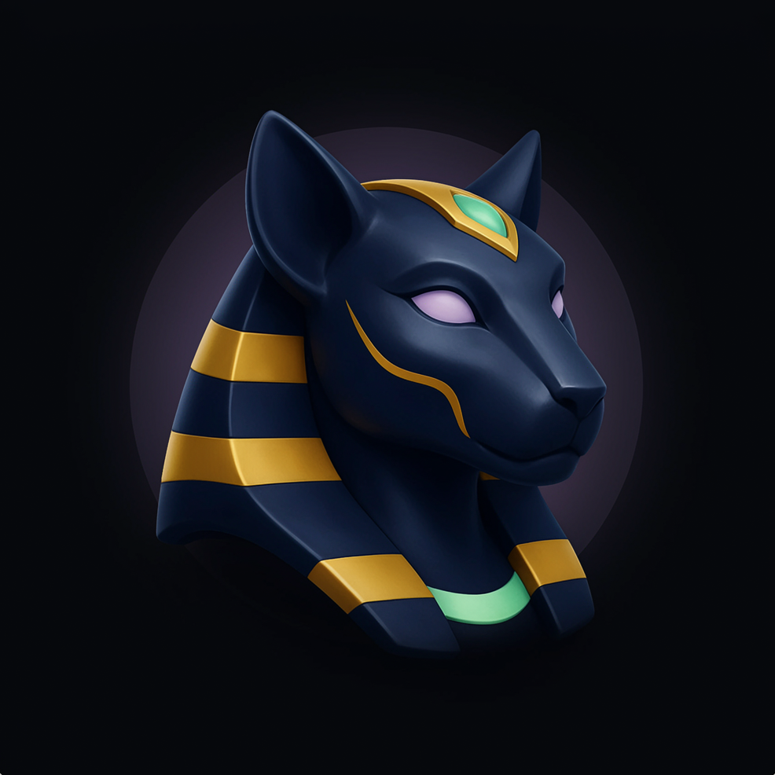
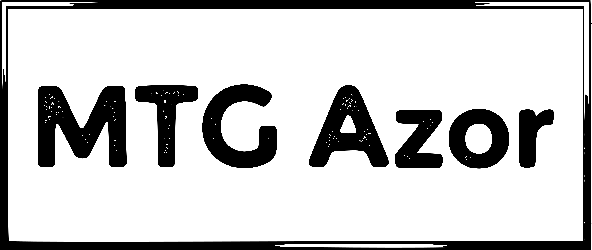
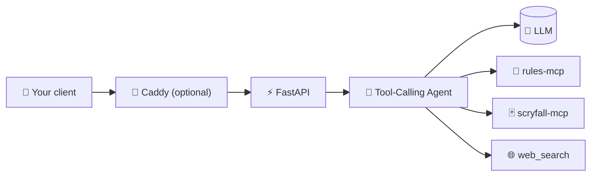

<h1 align="center">
  
  
</h1>

<p align="center">
  <i>An AI Magic: The Gathering rules judge — grounded, cited, and never guessing.</i>
</p>

<p align="center">
  <a href="LICENSE"></a>
  <a href="https://github.com/Delta-43/mtg-rules-agent/commits/main"></a>
  <a href="https://github.com/Delta-43/mtg-rules-agent/graphs/contributors"></a>
</p>

<p align="center">
  <a href="https://github.com/Delta-43/mtg-rules-agent/actions/workflows/server-ci.yml"></a>
  <a href="https://github.com/Delta-43/mtg-rules-agent/actions/workflows/scryfall-mcp-ci.yml"></a>
  <a href="https://github.com/Delta-43/mtg-rules-agent/actions/workflows/compose-validate.yml"></a>
  <a href="https://github.com/Delta-43/mtg-rules-agent/actions/workflows/beginner-setup-smoke-test.yml"></a>
</p>

<p align="center">
  
  
  
</p>

<p align="center">
  <a href="#-what-it-does">What it does</a> •
  <a href="#-architecture">Architecture</a> •
  <a href="#-project-status">Project Status</a> •
  <a href="#-quick-start">Quick Start</a> •
  <a href="#-tech-stack">Tech Stack</a> •
  <a href="#-documentation">Documentation</a>
</p>

> [!TIP]
> This repo ships no frontend — build your own client (web, Discord,
> Telegram, CLI, whatever) against `/chat`/`/chat/stream`, or start with
> [`scripts/chat_cli.py`](scripts/chat_cli.py) to try it from a terminal
> first.

---

## 🧠 What it does

MTG Azor answers Magic: The Gathering rules questions the way a real judge
would: by looking things up, not guessing from memory. A tool-calling
agent (not a fixed if/elif pipeline) decides for itself which of the
Comprehensive Rules, live Scryfall card data, official rulings, or the
open web it needs to check — then **every answer ends in a citation
block**, verified against the real tool results it just fetched, not just
requested by prompt.

This repo is the **reply server only** — a self-hostable backend you talk
to over HTTP (`/chat`, `/chat/stream`). It ships no fixed frontend: bring
your own client (a web app, a Discord/Telegram bot, a CLI, whatever) and
point it at the API.

- ⚖️ **Grounded answers** — rule numbers, official rulings, and source
  links are added only after being independently verified; nothing is
  cited from the model's memory.
- 🃏 **Live card data** — oracle text, legality, pricing, and rulings via
  a native Scryfall integration, always current.
- 🔍 **Falls back to the open web** — only for genuinely contested or
  ambiguous interactions the rules/rulings can't resolve on their own.
- 🔌 **Just an API** — no bundled frontend to fight; a plain `POST /chat`
  works from curl, a Discord bot, a Telegram bot, or your own web app.
- 🏠 **Self-hosted or public** — runs entirely on your own hardware with
  local models, or points at hosted LLM/embedding providers for a public
  deployment. One codebase, either way.

## 🏗️ Architecture



Every box above is a real, independently-runnable module —
`server/app_api/`, `server/llm_agent/`, `server/rules_mcp/`,
`server/scryfall_mcp/`, respectively. See
[Project Structure](#-project-structure) and
[`docs/DESCRIPTION.md`](docs/DESCRIPTION.md) for the full picture.

## 📊 Project Status

The agent, both MCP servers, and tiered auth/rate-limiting have all been
verified end-to-end against a real running deployment — see
[`server/STATUS.md`](server/STATUS.md) for the full current-status
breakdown (what's live, what's still scaffolding, what's left).

## 🚀 Quick Start

```bash
git clone https://github.com/Delta-43/mtg-rules-agent.git
cd mtg-rules-agent
./setup.sh      # interactive: pick chat/embedding provider, deployment shape
./run_bot.sh    # (dev-only shape) docker compose up rules-mcp/scryfall-mcp/searxng, then host uvicorn
```

`./setup.sh` asks a few questions the first time you run it — local Ollama or
hosted OpenRouter for chat, same for embeddings, and whether you want a local
dev setup only or the full Caddy-fronted deployment — then writes the
answers to a local `.env` file (never to a file this repo tracks). Run it
non-interactively with `./setup.sh --yes` to skip the prompts and keep
whatever's already configured (defaults to fully local on a first run).
Switching providers later is just editing `.env` and restarting; see
`docs/DESCRIPTION.md`'s environment variable reference for every setting.

```bash
curl -X POST http://localhost:8000/chat -H "Content-Type: application/json" \
  -d '{"query": "What happens during the untap step?"}'
```

Or skip curl and talk to it interactively from a terminal:

```bash
./scripts/chat_cli.py
```

A small reference client (streams tokens live, keeps the conversation going
across turns, prints citations) for trying the server out before building
your own client against the API — see `scripts/chat_cli.py --help`.

Want everything in Docker instead of the host+Docker hybrid above?
`docker compose up -d --build mtg-judge rules-mcp scryfall-mcp searxng`,
then hit `http://localhost:8000` directly (its own dev test UI at `/`,
plus `/chat`, `/chat/stream`, `/health`, `/metrics`). Add `caddy` to that
list for a reverse-proxy front door (real domain/TLS) — see
`docs/DESCRIPTION.md`'s deployment section.

For the full Docker deployment, environment variables, troubleshooting,
and the complete API reference, see
**[`docs/DESCRIPTION.md`](docs/DESCRIPTION.md)**.

## 🧰 Tech Stack

<table>
<tr>
<td><strong>Backend</strong></td>
<td>


</td>
</tr>
<tr>
<td><strong>Card Data Service</strong></td>
<td>


</td>
</tr>
<tr>
<td><strong>Data Sources</strong></td>
<td>


</td>
</tr>
<tr>
<td><strong>Infra & Deployment</strong></td>
<td>


</td>
</tr>
</table>

## 📁 Project Structure

```
mtg-rules-agent/
├── server/            # Backend: FastAPI, the agent, rules-mcp, scryfall-mcp
├── scripts/           # chat_cli.py (interactive test client), run_ollama.sh
├── assets/            # Brand images used by this README
├── docs/              # Architecture reference (docs/DESCRIPTION.md)
└── docker-compose.yml # Full stack + an optional reverse proxy (caddy)
```

`server/` has its own `README.md` (setup/run detail) and `STATUS.md`
(current status, features, what's left); start with
[`docs/DESCRIPTION.md`](docs/DESCRIPTION.md) for the full cross-cutting
picture.

## 📚 Documentation

| Document | What's in it |
|---|---|
| [`docs/DESCRIPTION.md`](docs/DESCRIPTION.md) | Full architecture, configuration, deployment, API reference, troubleshooting |
| [`CLAUDE.md`](CLAUDE.md) | Deep implementation notes — the non-obvious "why" behind the code |
| [`server/README.md`](server/README.md) | Backend setup & run instructions |
| [`server/STATUS.md`](server/STATUS.md) | Backend's current status, features, and what's left |

## 🤝 Contributing

See [`.github/CODEOWNERS`](.github/CODEOWNERS) for who reviews what.
Start with [`server/README.md`](server/README.md), then
[`docs/DESCRIPTION.md`](docs/DESCRIPTION.md) for how it fits together.

## 📄 License

[GNU AGPL v3.0](LICENSE)

---

<p align="center">
  <a href="https://github.com/Delta-43/mtg-rules-agent/graphs/contributors">
    
  </a>
</p>

<p align="center">
  <sub>Licensed under <a href="LICENSE">GNU AGPL v3.0</a>.</sub>
</p>
