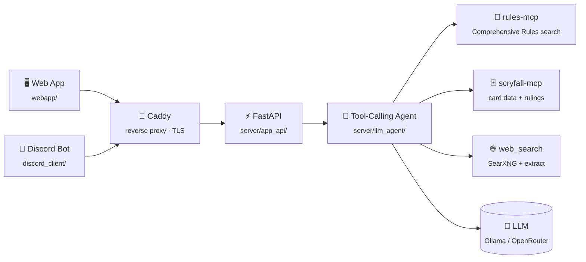

<h1 align="center">
  
  
</h1>

<p align="center">
  <i>An AI Magic: The Gathering rules judge — grounded, cited, and never guessing.</i>
</p>

<p align="center">
  <a href="LICENSE"></a>
  
  
  
  <a href="https://github.com/Delta-43/mtg_local_chatbot/graphs/contributors"></a>
  
</p>

<p align="center">
  
  
  
  
  
</p>

<p align="center">
  <a href="#-what-it-does">What it does</a> •
  <a href="#-architecture">Architecture</a> •
  <a href="#-project-status">Status</a> •
  <a href="#-quick-start">Quick Start</a> •
  <a href="#-tech-stack">Tech Stack</a> •
  <a href="#-documentation">Documentation</a>
</p>

---

## 🧠 What it does

MTG Azor answers Magic: The Gathering rules questions the way a real judge
would: by looking things up, not guessing from memory. A tool-calling
agent (not a fixed if/elif pipeline) decides for itself which of the
Comprehensive Rules, live Scryfall card data, official rulings, or the
open web it needs to check — then **every answer ends in a citation
block**, verified against the real tool results it just fetched, not just
requested by prompt.

- ⚖️ **Grounded answers** — rule numbers, official rulings, and source
  links are added only after being independently verified; nothing is
  cited from the model's memory.
- 🃏 **Live card data** — oracle text, legality, pricing, and rulings via
  a native Scryfall integration, always current.
- 🔍 **Falls back to the open web** — only for genuinely contested or
  ambiguous interactions the rules/rulings can't resolve on their own.
- 💬 **Two real surfaces** — a streaming web app and a Discord bot
  (`/judge`), both talking to the same public API.
- 🏠 **Self-hosted or public** — runs entirely on your own hardware with
  local models, or points at hosted LLM/embedding providers for a public
  deployment. One codebase, either way.

## 🏗️ Architecture



Every box above is a real, independently-runnable module — see
[Project Structure](#-project-structure) and
[`docs/DESCRIPTION.md`](docs/DESCRIPTION.md) for the full picture.

## 📊 Project Status

| Component | Status | Detail |
|---|:---:|---|
| Backend (agent, API, rules & card search) |  | [`server/`](server/README.md) |
| Web App (PWA) |  | [`webapp/`](webapp/README.md) · [visual redesign in progress](docs/WEBAPP_PLAN.md) |
| Discord Bot ("Azor, High Arbiter") |  | [`discord_client/`](discord_client/README.md) |
| Public Hosted Instance |  | `azor.delta43.net` |
| Accounts, Tiers & Billing |  | [plan](docs/PLAN.md) |
| CI/CD |  | [plan](docs/PUBLISHING_PLAN.md) |

Full feature-by-feature verification status lives in
[`docs/FEATURES.md`](docs/FEATURES.md); what's actively being worked on is
in [`docs/TODO.md`](docs/TODO.md).

## 🚀 Quick Start

```bash
git clone https://github.com/Delta-43/mtg_local_chatbot.git
cd mtg_local_chatbot
./setup.sh      # venv, deps, dedicated Ollama instance + model pulls
./run_bot.sh    # docker compose up rules-mcp/scryfall-mcp/searxng, then host uvicorn
```

```bash
curl -X POST http://localhost:8000/chat -H "Content-Type: application/json" \
  -d '{"query": "What happens during the untap step?"}'
```

For the full Docker deployment (public-facing, incl. Cloudflare Tunnel, R2
backup, and the Discord bot), environment variables, troubleshooting, and
the complete API reference, see **[`docs/DESCRIPTION.md`](docs/DESCRIPTION.md)**.

## 🧰 Tech Stack

<table>
<tr>
<td><strong>Backend</strong></td>
<td>


</td>
</tr>
<tr>
<td><strong>Web App</strong></td>
<td>


</td>
</tr>
<tr>
<td><strong>Discord Bot</strong></td>
<td>


</td>
</tr>
<tr>
<td><strong>Data Sources</strong></td>
<td>


</td>
</tr>
<tr>
<td><strong>Infra & Deployment</strong></td>
<td>


</td>
</tr>
</table>

## 📁 Project Structure

```
mtg_local_chatbot/
├── server/            # Backend: FastAPI, the agent, rules-mcp, scryfall-mcp
├── discord_client/    # Discord bot ("Azor, High Arbiter")
├── webapp/            # React + Vite PWA
├── ops/               # R2 backup/restore, future monitoring
├── shared/            # Cross-module brand assets & design reference
├── docs/              # Everything below — architecture, features, plans
└── docker-compose.yml # Full stack + optional profiles (tunnel/backup/discord/accounts)
```

Every module has its own README with setup/run detail for that piece
specifically — start there when working on a particular surface; start
with [`docs/DESCRIPTION.md`](docs/DESCRIPTION.md) for the full
cross-cutting picture.

## 📚 Documentation

| Document | What's in it |
|---|---|
| [`docs/DESCRIPTION.md`](docs/DESCRIPTION.md) | Full architecture, configuration, deployment, API reference, troubleshooting |
| [`docs/FEATURES.md`](docs/FEATURES.md) | Feature-by-feature requirement + verification catalog |
| [`docs/PLAN.md`](docs/PLAN.md) | What's done, and why, at the project level |
| [`docs/TODO.md`](docs/TODO.md) | The working next-steps list |
| [`docs/PUBLISHING_PLAN.md`](docs/PUBLISHING_PLAN.md) | Self-hosted OSS + hosted SaaS publishing strategy |
| [`docs/WEBAPP_PLAN.md`](docs/WEBAPP_PLAN.md) | In-progress PWA visual redesign |
| [`CLAUDE.md`](CLAUDE.md) | Deep implementation notes — the non-obvious "why" behind the code |
| [`server/README.md`](server/README.md), [`discord_client/README.md`](discord_client/README.md), [`webapp/README.md`](webapp/README.md), [`ops/README.md`](ops/README.md), [`shared/README.md`](shared/README.md) | Per-module setup & run instructions |

## 🤝 Contributing

The codebase is split into independent modules
(`server/`/`discord_client/`/`webapp/`/`ops/`) specifically so multiple
people can work on different surfaces without stepping on each other —
see [`.github/CODEOWNERS`](.github/CODEOWNERS) for who reviews what.
Start with the README of the module you're touching, then
[`docs/DESCRIPTION.md`](docs/DESCRIPTION.md) for how it fits into the
whole.

## 📄 License

[GNU AGPL v3.0](LICENSE)
